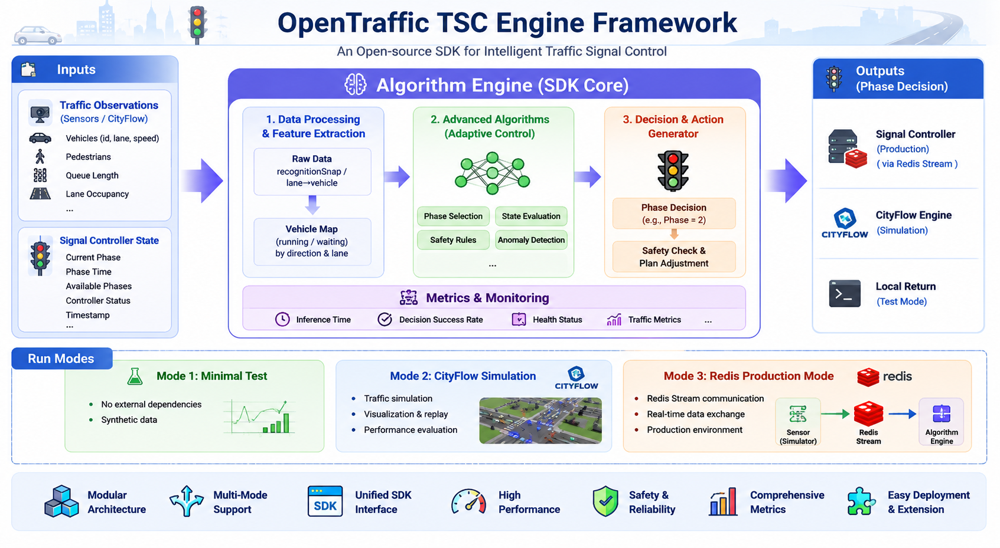

<div align="right">

[**中文**](README_CN.md) | **English**

</div>

<div align="center">

[](LICENSE)
[](https://www.python.org/)
[]()
[](https://github.com/OpenTraffic-Team/opentraffic-tsc-engine)

<br/>

[](https://huggingface.co/OpenTraffic)
[](https://x.com/OpenTraffic_CN)

</div>

### OpenTraffic — An open-source SDK for intelligent traffic signal control.

<div align="center">
  
</div>

<br/>

> **GitHub: https://github.com/OpenTraffic-Team/opentraffic-tsc-engine**

<br/>

## 🌟 Table of Contents

- [:rocket: Quick Start](#rocket-quick-start)
  - [Requirements](#requirements)
  - [Installation](#installation)
  - [Install CityFlow (optional)](#install-cityflow-optional)
- [:pencil: Configuration](#pencil-configuration)
  - [Intersection Configuration](#intersection-configuration)
  - [CityFlow Engine Configuration](#cityflow-engine-configuration)
  - [Redis / MQ Configuration](#redis--mq-configuration)
  - [Configuration Reference](docs/CONFIG_GUIDE.md)
- [:fire: Run Modes](#fire-run-modes)
  - [:ledger: Mode 1 — Minimal Test (no external dependencies)](#ledger-mode-1--minimal-test-no-external-dependencies)
  - [:ledger: Mode 2 — CityFlow Simulation](#ledger-mode-2--cityflow-simulation)
  - [:ledger: Mode 3 — Redis Production Mode](#ledger-mode-3--redis-production-mode)
- [:mechanical_arm: SDK Usage](#mechanical_arm-sdk-usage)
  - [:books: API Reference](#books-api-reference)
  - [:notebook: Input/Output Formats](#notebook-inputoutput-formats)
  - [:green_book: SDK Guide](docs/SDK_GUIDE.md)
- [:bar_chart: Evaluation Metrics](#bar_chart-evaluation-metrics)
- [:question: FAQ](#question-faq)
- [:heart: Acknowledgements](#heart-acknowledgements)

<br/>

## :rocket: Quick Start

### Requirements

- **OS**: Linux x86_64
- **Python**: >= 3.8

### Installation

```bash
# Clone the project
git clone https://github.com/OpenTraffic-Team/opentraffic-tsc-engine
cd opentraffic-tsc-engine

# One-click install (Python package + all dependencies)
pip install .
```

> PyTorch installs the CPU version by default. For GPU support, run `pip install torch --index-url https://download.pytorch.org/whl/cu118` first.

### Install CityFlow (optional)

Follow the [CityFlow installation guide](https://cityflow.readthedocs.io/en/latest/install.html).

> See [INSTALL.md](INSTALL.md) for detailed steps.

<br/>

## :pencil: Configuration

### Intersection Configuration

Intersection config files (e.g. `config/test_cityflow.json` or `config/test_net.json`) define signal control parameters:

| Field | Type | Description |
|--------|------|------|
| `cur_inter_id` | string | Intersection ID, e.g. `"XML_CNL"` |
| `lane_to_phase` | dict | Lane-to-phase mapping |
| `phases` | list | Available phase names |
| `stagePhase` | dict | Phase number → name mapping |
| `phase_min_change_time` | dict | Minimum green time per phase (seconds) |
| `phase_max_keep_time` | dict | Maximum green time per phase (seconds) |
| `algo_version` | string | Algorithm version (`"v1"`) |
| `cityflowTest` | int | CityFlow test flag (0/1) |
| `debug` | bool | Debug mode |
| `morning_rush` / `evening_rush` | list | Peak hours |

### CityFlow Engine Configuration

Located at `config/cityflow/`:

```
config/cityflow/
├── algo_config.yaml     # Algorithm parameters
├── config.json          # CityFlow engine parameters
├── roadnet.json         # Road network definition
└── flow.json            # Traffic flow definition (auto-generated)
```

### Redis / MQ Configuration

Edit `config/mq_config.json` for production mode Redis connection:

```json
{
    "redis_addr": "<Redis server IP>",
    "redis_port": 6379,
    "redis_password": "<password>",
    "intersection": "HHL_QHDD",
    "redis_keys": {
        "origin_state":       {"prefix": "origin_info_state", "db": 1},
        "env_state":          {"prefix": "signal_env_state",  "db": 0},
        "algorithm_control":  {"prefix": "algorithm_control", "db": 0},
        "signal_config":      {"prefix": "signalConfig",      "db": 0},
        "alg_config":         {"prefix": "algConfig",         "db": 0},
        "sensor_config":      {"prefix": "sensorConfig",      "db": 0},
        "hardware_config":    {"prefix": "intersection_device","db": 0}
    }
}
```

> For full configuration parameter details, see [Configuration Guide](docs/CONFIG_GUIDE.md)

<br/>

## :fire: Run Modes

### :books: Related Files
* `test_simple.py` — Minimal algorithm test (no external dependencies)
* `test_sdk_cityflow.py` — CityFlow integrated simulation test
* `run_algorithms_real.py` — Production mode algorithm main program

### :ledger: Mode 1 — Minimal Test (no external dependencies)

***Use case: quickly verify algorithm logic, no external services required.***

```bash
python test_simple.py
```

Runs the algorithm with synthetic data — no CityFlow, no Redis.

### :ledger: Mode 2 — CityFlow Simulation

***Use case: full CityFlow traffic simulation with visual replay support.***

```bash
# Run 3600-step adaptive algorithm simulation
python test_sdk_cityflow.py

# Custom step count
python test_sdk_cityflow.py --steps 600

# Fixed-time comparison mode
python test_sdk_cityflow.py --fixed
```

After simulation, open `frontend/index.html` in a browser and upload the replay file to view.

> When CityFlow is not installed, a built-in Mock engine is used automatically for algorithm logic verification.

### :ledger: Mode 3 — Redis Production Mode

***Use case: simulate a real production environment with data transferred via Redis Stream.***

**Architecture:**

```
┌──────────────────────────┐      ┌─────────────────┐
│ signal_env_simulator.py  │ ──→  │                 │
│ (simulates signal state   │      │   Redis Stream  │
│  push from controller)   │      │                 │
└──────────────────────────┘      │  origin_info_   │
                                  │  state:xxx      │
┌──────────────────────────┐      │  signal_env_    │
│ fake_push.py             │ ──→  │  state:xxx      │
│ (simulates sensor data   │      │  algorithm_     │
│  push)                   │      │  control:xxx    │
└──────────────────────────┘      │                 │
┌──────────────────────────┐      │                 │
│ run_algorithms_real.py   │ ←──→ │                 │
│ (algorithm main program) │      └─────────────────┘
└──────────────────────────┘
```

**Steps:**

```bash
# 1. Initialize Redis config (first time only)
python real_test/setup_redis_config.py

# 2. Start signal controller simulator
python real_test/signal_env_simulator.py

# 3. (Optional) Push fake algorithm data
python real_test/fake_push.py --phase 2

# 4. Start the algorithm main program
python run_algorithms_real.py
```

<br/>

## :mechanical_arm: SDK Usage

### :books: API Reference

The SDK provides two API layers:

| Layer | Class | Use Case |
|------|-----|----------|
| High-level | `AlgorithmSDK` | Unified interface, auto-adapts to different modes |
| Low-level | `AdvancedControl` | Direct invocation, supports `test=True` for local testing |

**Option 1: AlgorithmSDK (recommended)**

```python
from algorithms_sdk import AlgorithmSDK

# Simulation mode
sdk = AlgorithmSDK(
    mode="cityflow",
    config_path="config/test_cityflow.json",
    algo_version="v1"
)

# Execute decision
result = sdk.step(state, env_state)

# View metrics
metrics = sdk.get_metrics()

# Health check
health = sdk.get_health_status()

# Close
sdk.close()
```

**Option 2: AdvancedControl direct invocation**

```python
from algorithms_sdk.advanced_control import AdvancedControl

# test=True: local test, no Redis connection
algo = AdvancedControl(
    test=True,
    config_path="config/test_net.json"
)

# Execute decision
phase = algo.take_action(state, env_state)

# Production mode (with Redis)
# algo = AdvancedControl(mq_path="config/mq_config.json")
# phase = algo.take_action_to_redis()
```

### :notebook: Input/Output Formats

> **Critical flow**: Raw sensor data (`recognitionSnap` / CityFlow lane format) **must first be converted via feature extraction** to the `vehicle_map` format before the algorithm can consume it. The internal `OpenTrafficTSC_V1.algorithm_control()` directly reads `vehicle_map["waiting_vehicle"]` and `vehicle_map["running_vehicle"]` — skipping conversion will cause a `KeyError`.

---

#### Data Conversion Pipeline

```
Raw sensor data                      Feature extraction                      Algorithm input
────────────────────────────────────────────────────────────────────────────────────────────────

[Production] recognitionSnap format
{intersection_id: {
  recognitionSnap[road_X]: {         FeatureExtract                vehicle_map = {
    vehicles: [{id, lane,           .convert_cur_state()            running_vehicle: {WE: n, EW: n, ...},
     speed, type}]                   ──────────────►                waiting_vehicle: {WE: n, EW: n, ...},
  },                                 parses sensor config           running_person:  {S: n, W: n, ...},
  sensor_status: {...},              lane→phase mapping             lane_queue_length: [...],
  cameraState: {}                    classifies vehicles            num_in_deg: [...],
}}                                   (running/waiting)              vehicle_lane_to_phase: {...},
                                     groups by direction            timestamp: ...,
                                                                    cameraState: {...}
                                                                  }

[CityFlow simulation] lane→vehicle format
{intersection_id: {
  lane_id: [v1, v2, ...]            FeatureExtract                vehicle_map = {
}                                    .convert_cur_state_cf()        running_vehicle: {WE: n, EW: n, ...},
vehicles = {                         ──────────────►                waiting_vehicle: {WE: n, EW: n, ...}
  v1: {speed, running},                                             }
  v2: {speed, running},
}
```

##### When Conversion Functions Are Called

| Run Mode | Conversion Location | Notes |
|---------|-------------|------|
| **Production** (`take_action_to_redis`) | `AdvancedControl.take_action_to_redis()` internally calls `convert_cur_state()` | Converts right after pulling origin_state from Redis, then passes to `take_action()` |
| **CityFlow Simulation** | `SimulationAdapter.step()` internally calls `convert_cur_state_cf()` | Adapter layer handles conversion automatically |
| **Direct `take_action()` call** | **Not automatic** — caller must pre-convert | This is the most common pitfall, see examples below |

---

#### Format 1: CityFlow Simulation Format (input)

<details>
<summary><b>CityFlow raw format → converted format</b></summary>

**Raw data (passed to adapter/sdk):**

```python
state = {
    "HHL_QHDD": {
        "HHL_QHDD_N_0": ["v1", "v2"],
        "HHL_QHDD_N_1": [],
        "HHL_QHDD_S_0": ["v4"],
    }
}
vehicles = {
    "v1": {"speed": 5.0, "running": "1"},
    "v2": {"speed": 3.0, "running": "1"},
}
```

**After `convert_cur_state_cf()` conversion (passed to `take_action()`):**

```python
state = {
    "HHL_QHDD": {
        "running_vehicle": {"WE": 0, "EW": 0, "WN": 0, "ES": 0,
                            "NS": 0, "SN": 0, "NE": 0, "SW": 0},
        "waiting_vehicle": {"WE": 0, "EW": 0, "WN": 0, "ES": 0,
                            "NS": 0, "SN": 0, "NE": 0, "SW": 0}
    }
}
```

> In the CityFlow path, `SimulationAdapter.step()` calls `convert_cur_state_cf()` automatically — no manual conversion needed.
</details>

---

#### Format 2: Production recognitionSnap Format (input)

<details>
<summary><b>recognitionSnap raw format (sensor data)</b></summary>

This is the raw data format retrieved directly from Redis/sensors:

```python
state = {
    "XML_CNL": {
        "cameraState": {},
        "sensor_status": {"tirStatus[road_1]": {}, ...},
        "recognitionSnap[road_1]": {
            "timestamp": 1700000000,
            "vehicles": [
                {"id": "v1", "lane": "XML_CNL_N_0", "speed": [5.0], "type": "vehicle"}
            ]
        },
    }
}
```

**Field descriptions:**

| Field | Type | Description |
|------|------|------|
| `recognitionSnap[road_id]` | dict | **Must start with `recognitionSnap[`**, `road_id` must match a road ID in the sensor config |
| `recognitionSnap[road_id].vehicles` | list | Vehicle list, each containing `id`, `lane`, `speed` (array), `type` (`"vehicle"` or `"person"`) |
| `recognitionSnap[road_id].timestamp` | int | Sensor timestamp |
| `sensor_status` | dict | `tirStatus[road_id]` → sensor fault status (empty dict = normal) |
| `cameraState` | dict | Camera state (empty dict = normal) |
</details>

<details>
<summary><b>vehicle_map format after convert_cur_state()</b></summary>

**This is the actual format required for `state[intersection_id]` when passing to `take_action()`:**

```python
state = {
    "XML_CNL": {
        "running_vehicle": {
            "WE": 0, "EW": 1, "WN": 0, "ES": 0,
            "NS": 0, "SN": 0, "NE": 0, "SW": 0,
            "WW": 0, "EE": 0, "NN": 0, "SS": 0
        },
        "waiting_vehicle": {
            "WE": 0, "EW": 0, "WN": 0, "ES": 0,
            "NS": 0, "SN": 0, "NE": 0, "SW": 0,
            "WW": 0, "EE": 0, "NN": 0, "SS": 0
        },
        "running_person": {"S": 0, "W": 0, "N": 0, "E": 0},
        "lane_queue_length": [],       # Queue length per lane (v3)
        "num_in_deg": [],              # Waiting vehicles in each lane quarter (v3)
        "vehicle_lane_to_phase": {},   # Lane → vehicle list mapping
        "timestamp": 1700000000,
        "cameraState": {}
    }
}
```

**Field descriptions:**

| Field | Description |
|------|------|
| `running_vehicle` | Count of **running** vehicles by direction (WE/EW/NS/SN/...) — speed > `MIN_RUNNING_SPEED` |
| `waiting_vehicle` | Count of **waiting** vehicles by direction — speed <= `MIN_RUNNING_SPEED` |
| `running_person` | Pedestrian count by direction |
| `lane_queue_length` | Queue length per entry lane (v3 only) |
| `num_in_deg` | Waiting vehicles in each of the 4 equal-length segments per lane (v3 only) |
| `vehicle_lane_to_phase` | Vehicle object list per lane (for v3 feature extraction) |
| `timestamp` | Maximum timestamp from sensor data |
| `cameraState` | Fault status of each sensor |

> **Direction code meaning**: two letters indicate from→to, e.g. `WE` = West→East (through), `WN` = West→North (left turn), `SW` = South→West (right turn).
</details>

---

#### Correct Way to Call `take_action()` Directly

When calling `take_action()` directly, you **must first convert raw data via `convert_cur_state()`**. In production mode this is done automatically inside `take_action_to_redis()`, but direct calls will not.

**Wrong usage (missing conversion, will crash with KeyError):**

```python
algo = AdvancedControl(test=True, config_path="config/test_net.json")

# Raw recognitionSnap data
raw_state = {
    "XML_CNL": {
        "recognitionSnap[road_1]": {
            "vehicles": [{"id": "v1", "lane": "XML_CNL_N_0", "speed": [5.0], "type": "vehicle"}]
        }
    }
}

# ❌ Passing raw data directly — state["XML_CNL"] lacks "waiting_vehicle" key,
#    OpenTrafficTSC_V1.algorithm_control() will throw KeyError
phase = algo.take_action(raw_state, env_state)
```

**Correct usage:**

```python
algo = AdvancedControl(test=True, config_path="config/test_net.json")

raw_state = {
    "XML_CNL": {
        "recognitionSnap[road_1]": {
            "vehicles": [{"id": "v1", "lane": "XML_CNL_N_0", "speed": [5.0], "type": "vehicle"}]
        },
        "sensor_status": {"tirStatus[road_1]": {}},
        "cameraState": {}
    }
}

# ✅ Convert first, then call
vehicle_map = algo.convert_cur_state(raw_state)
state = {algo.config.INTERSECTION: vehicle_map}

phase = algo.take_action(state, env_state)
```

---

#### Sensor Configuration & Data Alignment

`FeatureExtract.convert_cur_state()` relies on **sensor configuration** to parse `recognitionSnap` data:

- `road_id` in `recognitionSnap[road_id]` must match a road (`roads[].id`) or crosswalk (`crosswalks[].id`) in the sensor config
- If no match is found, the data is silently skipped (no error, but all vehicle data is lost)
- `vehicle["lane"]` must match a key in the algorithm config's `lane_to_phase`, otherwise the vehicle is skipped
- Sensor config is loaded via:
  - **Production mode**: reads `sensorConfig` key from Redis
  - **Test mode**: uses `DEFAULT_SENSOR_CONF` (`algorithms/utils/config.py`) or the `sensor_cnf` parameter

---

#### env_state (Signal Controller State)

```python
env_state = {
    "phases": [1, 2],               # Available phase numbers
    "currentPhase": 1,              # Current phase number
    "phaseTime": 30,                # Current phase elapsed time (seconds)
    "currentPlan": "1",             # Current plan
    "signalCtlStatus": True,        # Whether controller is in control
    "timestamp": 1700000000.0
}
```

#### Return Value

```python
# take_action() return value:
phase = 1       # Normal decision: phase number
phase = None    # Safety rule failed or anomaly detection triggered

# AlgorithmSDK.step() return value:
@dataclass
class DecisionResult:
    action: PhaseAction        # Decision action
    timestamp: float           # Timestamp
    inference_time_ms: float   # Inference time (milliseconds)
    algorithm_version: str     # Algorithm version
```

<br/>

<br/>

## :bar_chart: Evaluation Metrics

Run the CityFlow simulation test to evaluate algorithm performance:

```bash
# Adaptive algorithm (default)
python test_sdk_cityflow.py --steps 3600

# Fixed-time baseline for comparison
python test_sdk_cityflow.py --fixed --steps 3600
```

### Output Metrics

| Metric | Description | Formula |
|--------|-------------|---------|
| **Total Vehicles** | All vehicles spawned during simulation | — |
| **Completed Vehicles** | Vehicles that finished their route | — |
| **Still in Network** | Vehicles not yet exited at simulation end | — |
| **Avg Travel Time** | Mean time from spawn to exit (seconds) | `sum(travel_times) / completed` |
| **Avg Delay** | Extra time vs. free-flow (seconds) | `avg_travel_time − free_flow_time` |
| **Avg Queue Length** | Mean waiting vehicles per step | `sum(waiting_vehicles) / total_steps` |
| **Max Queue Length** | Peak waiting vehicles during simulation | `max(current_waiting)` |
| **Avg Wait Time** | Mean time each vehicle spent waiting (seconds) | `sum(vehicle_wait_steps) / total_spawned` |
| **Avg Stops** | Mean stops per completed vehicle | `total_stops / completed` |
| **Stop Rate** | Percentage of vehicles that stopped at least once | `stopped_vehicles / total_spawned × 100%` |
| **Throughput** | Vehicles completed per second | `completed / total_steps` |
| **Phase Switches** | Total signal phase changes (adaptive only) | — |

### Sample Output

```
[4] Simulation Complete — Adaptive Algorithm Control
  ┌─────────────────────────────────────────────────────┐
  │ Metric                         Value                │
  ├─────────────────────────────────────────────────────┤
  │ Steps                           3600 steps (3600s)  │
  │ Total Vehicles                   875 vehicles        │
  │ Completed Vehicles               832 vehicles        │
  │ Still in Network                  43 vehicles        │
  │ Avg Travel Time                  35.2 s/veh         │
  │ Avg Delay                        17.2 s/veh         │
  │ Avg Queue Length                  4.3 veh/step      │
  │ Max Queue Length                  15 vehicles        │
  │ Avg Wait Time                     8.5 s/veh         │
  │ Avg Stops                         1.2 stops/veh     │
  │ Stop Rate                        68.5 %             │
  │ Throughput                       0.231 veh/s        │
  │ Phase Switches                     52 switches       │
  └─────────────────────────────────────────────────────┘
```

### Comparing Algorithms

Run both modes separately, or use the one-shot comparison:

```bash
# Adaptive only
python test_sdk_cityflow.py --steps 3600

# Fixed-time only
python test_sdk_cityflow.py --fixed --steps 3600

# One-shot comparison (identical traffic seed for fairness)
python test_sdk_cityflow.py --compare --steps 3600
```

The `--compare` mode runs both algorithms and prints a comparison report:

```
=================================================================
  Algorithm Comparison Report
=================================================================
  Metric                      Adaptive   Fixed-time   Improvement
  -----------------------------------------------------------------
  Completed Vehicles(↑)          832        798      📈 +4.3%
  Still in Network(↓)             43         77      📈 +44.2%
  Avg Travel Time(↓)           35.2s      42.1s      📈 +16.4%
  Avg Delay(↓)                 17.2s      24.1s      📈 +28.6%
  Avg Queue Length(↓)           4.3        7.8       📈 +44.9%
  Max Queue Length(↓)            15         28       📈 +46.4%
  Avg Wait Time(↓)              8.5s      14.2s      📈 +40.1%
  Avg Stops(↓)                  1.2        2.1       📈 +42.9%
  Stop Rate(↓)                  68.5%      82.3%     📈 +16.8%
  Throughput(↑)                 0.231      0.222     📈 +4.1%
  Phase Switches                 52         18            —
  -----------------------------------------------------------------
  (↑) higher is better  (↓) lower is better
  📈 significant improvement  📉 regression  ➖ no change
```

Key comparison dimensions:
- **Delay reduction**: adaptive vs fixed-time travel time difference
- **Queue management**: lower average queue = better traffic clearing; max queue reflects peak pressure
- **Stop frequency**: fewer stops = better driving experience and lower fuel consumption
- **Throughput**: higher throughput = more efficient intersection

### Runtime Metrics (SDK)

The SDK also tracks runtime performance via `get_metrics()`:

```python
metrics = sdk.get_metrics()
# MetricsData(
#     total_decisions=3600,
#     successful_decisions=3598,
#     failed_decisions=2,
#     avg_inference_time_ms=12.5
# )
```

| Metric | Description |
|--------|-------------|
| `total_decisions` | Total number of decisions made |
| `successful_decisions` | Decisions that returned a valid phase |
| `failed_decisions` | Decisions that failed (returned `None`) |
| `avg_inference_time_ms` | Average inference time per decision |
| `success_rate` | `successful / total * 100%` |

<br/>

## :question: FAQ

<details>
<summary><b>SO file failed to load?</b></summary>

```bash
uname -m                          # Should output x86_64
python -c "import struct; print(struct.calcsize('P')*8)"  # Should output 64
```
</details>

<details>
<summary><b>License verification failed?</b></summary>

Check that the system time is correct and algorithm files are valid.
</details>

<details>
<summary><b>CityFlow not installed?</b></summary>

Running `test_sdk_cityflow.py` will automatically switch to Mock engine mode.
</details>

<details>
<summary><b>Redis connection failed?</b></summary>

```bash
python -c "import redis; r=redis.Redis(host='<IP>', port=6390, password='<PWD>'); print(r.ping())"
```
</details>

<br/>

## :heart: Acknowledgements

Thanks to [CityFlow](https://github.com/cityflow-project/CityFlow) for the open-source traffic simulation platform!

## 🌟 Star History

<a href="https://www.star-history.com/#OpenTraffic-Team/opentraffic-tsc-engine&Date">
  
</a>

<br/>

## 📮 Contact

<div align="center">

📧 Email: **partners@opentraffic.cn**

<br/>


*WeChat Official Account*

</div>
